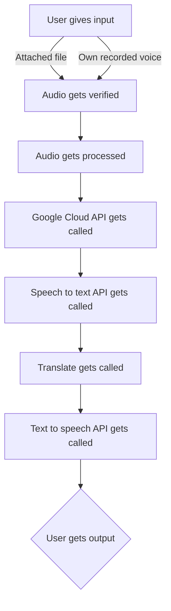

# Speech To Text 2 Text To Speech (STT2TTS)

This is a small school project composed by [Tsadriu](https://tsadriu.dev), [AlexDevs](https://alexdevs.me) and Zina Gharsalloui. 

<h2><i>If you wanna fork this project, you need to setup a Google Cloud Project because we have shut down this one.</i></h2>

# What does it do?

STT2TTS is a small service that uses the Google Cloud API such as:
- Translate
- Speech to text
- Text to speech

It accepts an audio file from the user (or on-page recording) and translates the audio into text based on the user's selected language.

# Graph of the service

